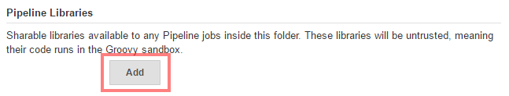
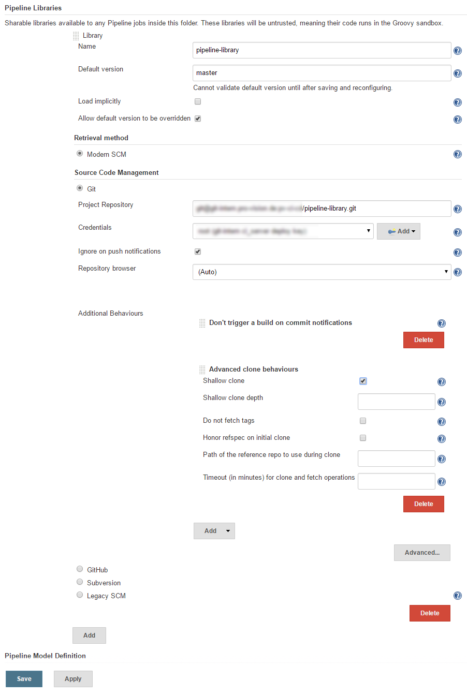
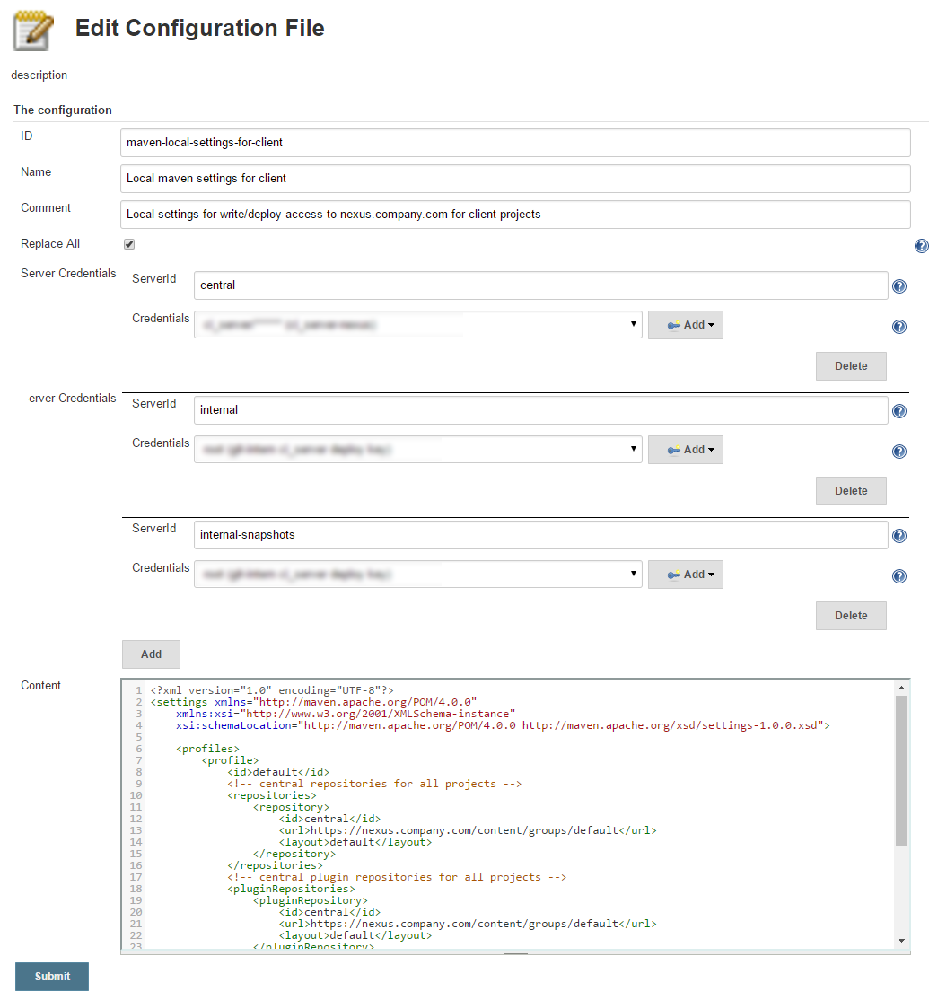

# Setup your Environment for Pipeline library

There are two ways to start using the Pipeline library.

**Variant 1** (not recommended)

Fork the repo and add the json configurations for managed files,
credentials etc.

**Variant 2** (recommended)

Create a separate repository containing your pipeline library and add
the configurations there. This will keep your setup clean and ensures
maintainability.

This tutorial only covers Variant 2.

:bulb: Before you start, it is recommended to read
[Extending with Shared Libraries](https://jenkins.io/doc/book/pipeline/shared-libraries/)
from Jenkins documentation.

# Table of contents
* [Requirements](#requirements)
* [Tutorial Background](#tutorial-background)
* [Step 1: Include the Pipeline in your Jenkins instance.](#step-1-include-the-pipeline-in-your-jenkins-instance)
* [Step 2: Use the library in a job](#step-2-use-the-library-in-a-job)
* [Step 3: Setup managed file and credential auto lookup](#step-3-setup-managed-file-and-credential-auto-lookup)
    * [SCM credentials](#scm-credentials)
    * [Maven global settings](#maven-global-settings)
    * [Maven local settings](#maven-local-settings)
    * [npmrc and npm user config](#npmrc-and-npm-user-config)
    * [Bundler config auto lookup](#bundler-config-auto-lookup)
* [Step 4: Add your library to jenkins and test auto lookup](#step-4-add-your-library-to-jenkins-and-test-it)

## Requirements

Have a look at [Requirements](requirements.md) to get the library running.

## Tutorial Background

In this tutorial we assume the following background.

You are DevOps Engineer working in a company named "Company" and you
have the following eco system:
* jenkins.company.com - Jenkins Instance
* git.company.com - Git Server
* nexus.company.com - Sonatype Nexus artifact server
* npm.company.com - NPM repository
* bundler.company.com - Ruby bundler repository

and all services are reachable over https.

## Step 1: Include the Pipeline in your Jenkins instance.

There are several ways to include the library in your Jenkins instance:

* Global Shared Pipeline Library
* Folder based Shared Pipeline Library
* Project based Shared Pipeline Library
* Dynamic loading from SCM within your pipeline script.

It is recommended to use folder based shared library!

* Goto https://jenkins.company.com and create a new folder named
"tutorial".
* In the configure screen click on "Add" in the Pipeline Libraries
  section.
   and
  configure the pipeline as in the following screenshot:
  
* Explanation:
  * Name = `pipeline-library` (you can of course use your own name here)
  * Default Version = `master` (use either master or a tag)
  * Retrival Method is `Modern SCM` and we are checking out from a git
    repository
  * Make sure to check `Ignore on push notifications`, enable `Don't
    trigger a build on commit notifications` and add `Advanced clone
    behaviors` with `Shallow clone` enabled
  * The GIT extensions ensure that a new master version of the pipeline
    library will not
    * make your Jenkins going crazy by building every using job with an SCM
      trigger
    * show the changelog of the pipeline library in your using jobs

## Step 2: Use the library in a job

* Goto https://jenkins.company.com/job/tutorial/ and create a new
  Pipeline job named 'Demo'
* Add the following script in the Pipeline script field:
  ```groovy
   @Library ('pipeline-library') pipelineLibrary

   import io.wcm.devops.jenkins.pipeline.utils.logging.*

   Logger.init(steps, LogLevel.INFO)
   Logger log = new Logger(this)

   log.info("This is an info log from the pipeline library")      
  ```
* run the job

You should see some checkout logs and at the end of the job the follwing
output:

```text
[Pipeline] echo
[INFO] WorkflowScript : This is an info log from the pipeline library
[Pipeline] End of Pipeline
Finished: SUCCESS
```

Congratulations, you are now ready to use the pipeline library

## Step 3: Setup managed file and credential auto lookup

To use the auto lookup functionalities you need your own library in a
SCM repository (GIT is preferred)

You can use
[Pipeline Library Example](https://github.com/wcm-io-devops/jenkins-pipeline-library-example)
as starting point for your own pipeline libray.

:bulb: Pipeline libraries are only valid if they contain at least one
class below `src` or one step/var below `vars`.

The example lib consists out of
* Configuration for SCM credential auto lookup
* Configuration for global and local Maven settings auto lookup
* Configuration for npmrd and npm user config auto lookup
* Configuration for Bundler config auto lookup
* A sample class ([`src/com/company/jenkins/pipeline/Demo.groovy`](https://github.com/wcm-io-devops/jenkins-pipeline-library/pipeline-library-example/blob/master/vars/customStep.groovy))
* A sample step
  ([`vars/demo.groovy`](https://github.com/wcm-io-devops/jenkins-pipeline-library/pipeline-library-example/blob/master/vars/demo.groovy))

### SCM credentials

The file
[`credentials.json`](https://github.com/wcm-io-devops/jenkins-pipeline-library/pipeline-library-example/blob/master/resources/credentials/scm/credentials.json)
contains the user data for checking out from your company git server.

Since GIT checkout can be done via SSH and HTTPS there are two
credentials configured.

### Maven global settings

The
[`global-settings.json`](https://github.com/wcm-io-devops/jenkins-pipeline-library/pipeline-library-example/blob/master/resources/mangedfiles/maven/global-settings.json)
specifies the global maven settings `maven-global-settings-for-company`
(stored in Jenkins via Config File Provider plugin), which is valid for
all maven builds.

This would be used by all projects checked out from git.company.com.

The global settings xml for the example looks like this:
```xml
<?xml version="1.0" encoding="UTF-8"?>
<settings xmlns="http://maven.apache.org/POM/4.0.0"
    xmlns:xsi="http://www.w3.org/2001/XMLSchema-instance"
    xsi:schemaLocation="http://maven.apache.org/POM/4.0.0 http://maven.apache.org/xsd/settings-1.0.0.xsd">

    <profiles>
        <profile>
            <id>default</id>
            <!-- central repositories for all projects -->
            <repositories>
                <repository>
                    <id>central</id>
                    <url>https://nexus.company.com/content/groups/default</url>
                    <layout>default</layout>
                </repository>		
            </repositories>
            <!-- central plugin repositories for all projects -->
            <pluginRepositories>	  	
                <pluginRepository>
                    <id>central</id>
                    <url>https://nexus.company.com/content/groups/default</url>
                    <layout>default</layout>
                </pluginRepository>		
            </pluginRepositories>
        </profile>
    </profiles>

    <activeProfiles>
        <activeProfile>default</activeProfile>
    </activeProfiles>

    <!-- authentication for maven repositories -->
    <servers>
        <!-- the server credentials are configured by using credentials on the configuration screen -->
    </servers>
</settings>
```

### Maven local settings

The
[`settings.json`](https://github.com/wcm-io-devops/jenkins-pipeline-library/pipeline-library-example/blob/master/resources/mangedfiles/maven/settings.json)
specifies client/project specific maven settings
`maven-local-settings-for-client` (stored in Jenkins via Config File
Provider plugin), which is valid for all maven builds where the scm url
is matching `git\.company\.com[:/]client/project.git`.

This credentials (stored in jenkins) would have the credentials
configured for deploying into the artifact manager.

The local settings xml for the example looks like this:
```xml
<?xml version="1.0" encoding="UTF-8"?>
<settings xmlns="http://maven.apache.org/POM/4.0.0"
    xmlns:xsi="http://www.w3.org/2001/XMLSchema-instance"
    xsi:schemaLocation="http://maven.apache.org/POM/4.0.0 http://maven.apache.org/xsd/settings-1.0.0.xsd">

    <profiles>
        <profile>
            <id>default</id>
            <!-- central repositories for all projects -->
            <repositories>
                <repository>
                    <id>central</id>
                    <url>https://nexus.company.com/content/groups/default</url>
                    <layout>default</layout>
                </repository>		
            </repositories>
            <!-- central plugin repositories for all projects -->
            <pluginRepositories>	  	
                <pluginRepository>
                    <id>central</id>
                    <url>https://nexus.company.com/content/groups/default</url>
                    <layout>default</layout>
                </pluginRepository>		
            </pluginRepositories>
        </profile>
    </profiles>

    <activeProfiles>
        <activeProfile>default</activeProfile>
    </activeProfiles>

    <!-- authentication for maven repositories -->
    <servers>
        <!-- the server credentials are configured by using credentials on the configuration screen -->
    </servers>
</settings>
```

This looks strange because this is the same content, but the idea is to
configure the deploy credentials here:


### npmrc and npm user config

[`npm-config-userconfig.json`](https://github.com/wcm-io-devops/jenkins-pipeline-library/pipeline-library-example/blob/master/resources/mangedfiles/npm/npm-config-userconfig.json)
and
[`npmrc`](https://github.com/wcm-io-devops/jenkins-pipeline-library/pipeline-library-example/blob/master/resources/mangedfiles/npm/npmrc.json)
are used to specify the NPM settings for your npm.company.com repository.

Example for the managed file with id:
`npm-settings-for-company-repository`

```text
registry = https://npm.company.com/repository/npm-default/
always-auth = true
_auth = dGhpc2lzYXBpcGVsaW5lZGVtaQ==
```

## Bundler config auto lookup

[`bundle-config.json`](https://github.com/wcm-io-devops/jenkins-pipeline-library/pipeline-library-example/blob/master/resources/mangedfiles/ruby/bundle-config.json)
is used to define your settings for using bundler.company.com repository.

Example for the managed file with id:
`bundler-settings-for-company-repository`

```yaml
---
BUNDLE_FROZEN: '1'
BUNDLE_BIN: .rubygems/bin
BUNDLE_MIRROR__HTTPS://RUBYGEMS__ORG/: https://bundler.company.com/content/groups/rubygems-default
BUNDLE_BUNDLER__COMPANY__COM: company-jenkins-user-name:company-jenkins-user-password
```

## Step 4: Add your library to jenkins and test it

Add your library with the name `pipeline-library-example` and version
`master` to the https://jenkins.company.com/job/tutorial/ folder as
described in [step 2](#step-2-use-the-library-in-a-job)

Go to the configuration page of the test job
https://jenkins.company.com/job/tutorial/job/Test/configure and change
the pipeline script to

```groovy
@Library('pipeline-library@feature') pipelineLibrary
@Library('pipeline-library-example') pipelineLibraryExample

import io.wcm.devops.jenkins.pipeline.utils.logging.Logger
import io.wcm.devops.jenkins.pipeline.utils.logging.LogLevel

Logger.init(steps, LogLevel.INFO)
Logger log = new Logger(this)
  
log.info("This is an info log from the pipeline library")  

// allocate a node cause some step need them
node() {
    // call the demo step from pipeline-library-example
    demo()
    // call the test step for auto lookup
    testAutoLookup()
}
```

`testAutolookup` will try to lookup
* Credentials
* Maven Settings
* NPM Settings and
* Bundler Settings

for the scm url `git@git.company.com/client/project.git`

Now run the job and the output should look like this:

```text
[INFO] demo : I am a custom step
[Pipeline] echo
[INFO] com.company.jenkins.pipeline.Demo : Hello!
[Pipeline] libraryResource
[Pipeline] readJSON
[Pipeline] echo
[INFO] testAutoLookup : Found credential for scm url 'git@git.company.com/client/project.git': 'GIT-SSH-company-credentials'
[Pipeline] echo
[INFO] testAutoLookup : Got correct credential/managed file with id: GIT-SSH-company-credentials
[Pipeline] libraryResource
[Pipeline] readJSON
[Pipeline] echo
[INFO] testAutoLookup : Found managed file for scm url 'git@git.company.com/client/project.git': 'maven-global-settings-for-company'
[Pipeline] echo
[INFO] testAutoLookup : Got correct credential/managed file with id: maven-global-settings-for-company
[Pipeline] libraryResource
[Pipeline] readJSON
[Pipeline] echo
[INFO] testAutoLookup : Found managed file for scm url 'git@git.company.com/client/project.git': 'maven-local-settings-for-client'
[Pipeline] echo
[INFO] testAutoLookup : Got correct credential/managed file with id: maven-local-settings-for-client
[Pipeline] libraryResource
[Pipeline] readJSON
[Pipeline] echo
[INFO] testAutoLookup : Found managed file for scm url 'git@git.company.com/client/project.git': 'npm-settings-for-company-repository'
[Pipeline] echo
[INFO] testAutoLookup : Got correct credential/managed file with id: npm-settings-for-company-repository
[Pipeline] libraryResource
[Pipeline] readJSON
[Pipeline] echo
[INFO] testAutoLookup : Found managed file for scm url 'git@git.company.com/client/project.git': 'npmrc-settings-for-company-repository'
[Pipeline] echo
[INFO] testAutoLookup : Got correct credential/managed file with id: npmrc-settings-for-company-repository
[Pipeline] libraryResource
[Pipeline] readJSON
[Pipeline] echo
[INFO] testAutoLookup : Found managed file for scm url 'git@git.company.com/client/project.git': 'bundler-settings-for-company-repository'
[Pipeline] echo
[INFO] testAutoLookup : Got correct credential/managed file with id: bundler-settings-for-company-repository
```

