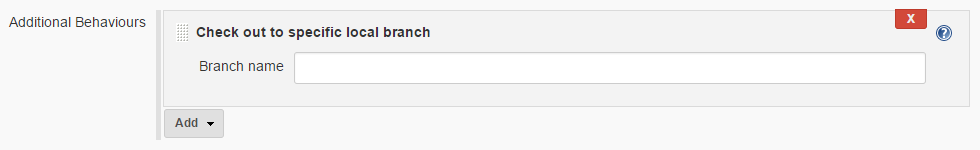
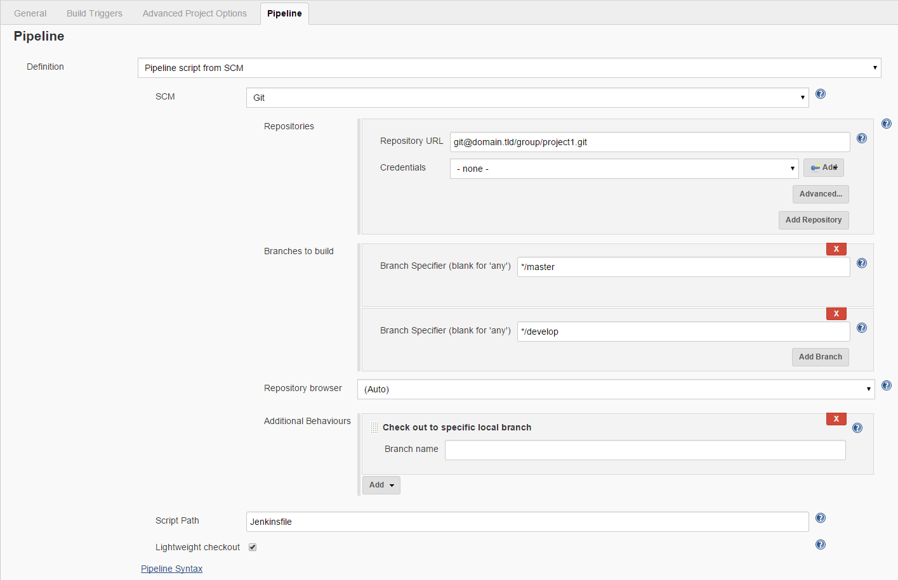

# checkoutScm

The main purpose of the checkoutScm step is to remove some complexity
from pipeline scripts and bring back some functionality not existing yet
in Jenkins pipeline.

# Table of contents
* [Features](#features)
    * [Credential auto lookup](#credential-auto-lookup)
    * [GIT_BRANCH environment variable support](#git-branch-environment-variable-support)
    * [SCM_URL environment variable support](#scm-url-environment-variable-support)
* [Modes](#modes)
    * [Mode 1 (Configuration Mode)](#mode-1-configuration-mode)
        * [Example 1: Simple checkout](#example-1-simple-checkout)
        * [Example 2: Advanced checkout](#example-2-advanced-checkout)
        * [Example 3: Checkout with url and credentialId](#example-3-checkout-with-url-and-credentialid)
        * [Example 4: Checkout with userRemoteConfigs](#example-4-checkout-with-userremoteconfigs)
    * [Mode 2 (Job SCM Configuration)](#mode-2-job-scm)
* [Configuration options](#configuration-options)
    * [`branches`](#branches-optional)
    * [`credentialsId`](#credentialsid-optional)
    * [`doGenerateSubmoduleConfigurations`](#dogeneratesubmoduleconfigurations-optional)
    * [`extensions`](#extensions-optional)
    * [`submoduleCfg`](#submodulecfg--optional)
    * [`url`](#url)
    * [`userRemoteConfig`](#userremoteconfig-optional)
    * [`userRemoteConfigs`](#userremoteconfigs-optional)
    * [`useScmVar`](#usescmvar-optional)
* [Related classes](#related-classes)

## Features
### Credential auto lookup

Especially in company environments where you have one account for
Jenkins checkouts setting the correct credentials in each
project/pipeline script can be annoying.

If you provide a JSON file at this location
`resources/credentials/scm/credentials.json` in the format described in
[Credentials](../docs/credentials.md) the step will
automatically try to lookup the credentials for the provided scm url and
use them

This step uses the best match by using the
[PatternMatcher](../src/io/wcm/tooling/jenkins/pipeline/utils/PatternMatcher.groovy)
so the Credential with the most matching characters will be used for checkout.

### GIT_BRANCH environment variable support

With Jenkins pipeline the support for the GIT_BRANCH environment
variable was removed. This step reenables this functionality by calling
the [setGitBranch](setGitBranch.md) step after checkout.

:bulb: If you are using [Mode 2 (Job SCM)](#mode-2-job-scm-configuration) you have to
add the "Check out to specific local branch" extension with empty branch
name


### SCM_URL environment variable support

With pipeline also the SCM_URL environment variable disappeared. This
step reenables this functionality by calling the
[setScmUrl](setScmUrl.md) step after checkout

## Modes

The checkoutScm option run with two modes

### Mode 1 (Configuration Mode)

This mode is used when your Jenkinsfile and the project to build are not
in the same repository.

You have to provide a configuration for this step. The configuration
uses the same format/syntax as the `checkout: General SCM` step for GIT.

:bulb: See also
[How to Customize Checkout for Pipeline Multibranch](https://support.cloudbees.com/hc/en-us/articles/226122247-How-to-Customize-Checkout-for-Pipeline-Multibranch)

You have to provide at least the repository `url` for the checkout or a
`userRemoteConfig` or `userRemoteConfigs` configuration.

#### Examples

##### Example 1: Simple checkout
```groovy
import static io.wcm.tooling.jenkins.pipeline.utils.ConfigConstants.*

checkoutScm( 
    (SCM) : [
        (SCM_URL) : "git@domain.tld/group/project.git",
    ]
)
```

##### Example 2: Advanced checkout
```groovy
import static io.wcm.tooling.jenkins.pipeline.utils.ConfigConstants.*

checkoutScm( 
    (SCM) : [
        (SCM_URL) : "git@domain.tld/group/project.git",
        (SCM_BRANCHES) : [[name: '*/master'], [name: '*/develop']],
        (SCM_DO_GENERATE_SUBMODULE_CONFIGURATION) : false,
        (SCM_EXTENSIONS) : [[$class: 'LocalBranch']]
    ]
)
```

##### Example 3: Checkout with url and credentialId
```groovy
import static io.wcm.tooling.jenkins.pipeline.utils.ConfigConstants.*

checkoutScm( 
    (SCM) : [
        (SCM_URL) : "git@domain.tld/group/project.git",
        (SCM_CREDENTIALS_ID) : "jenkins-credential-id",
        (SCM_BRANCHES) : [[name: '*/master'], [name: '*/develop']],
    ]
)
```

##### Example 4: Checkout with userRemoteConfigs
```groovy
import static io.wcm.tooling.jenkins.pipeline.utils.ConfigConstants.*

checkoutScm( 
    (SCM) : [
        (SCM_BRANCHES) : [[name: '*/master'], [name: '*/develop']],
        (SCM_EXTENSIONS) : [[$class: 'LocalBranch']],
        (SCM_USER_REMOTE_CONFIGS) : [[credentialsId: 'jenkins-credential-id', url: 'git@domain.tld/group/project.git']]
    ]
)
```

### Mode 2 (Job SCM Configuration)

This mode is used when your Jenkinsfile and the project to build are in
the same repository. In this case the pipeline has an `scm` variable
which contains the configuration made on the Job page.



To do a checkout within your pipeline script with this mode you have to
call the step in your pipeline as follows:

```groovy
import static io.wcm.tooling.jenkins.pipeline.utils.ConfigConstants.*

checkoutScm( 
    (SCM): [
        (SCM_USE_SCM_VAR): true
    ]
)
```

The scm checkout will be executed exactly with the options you specified
on the job page so you can for example to merges with branches, specifiy
advanced clone behaviors etc.

The GIT_BRANCH and SCM_URL detection also works in this mode

:bulb: In order to detect the branch name please add the "Checkout to
specific local branch" option

:bulb: When `useScmVar` is set to true this will overwrite any other option specified

## Configuration options

Complete list of all configuration options. Please note that they can
not be used all at the same time.

All configuration options must be inside the `scm`
([`ConfigConstants.SCM`](../src/io/wcm/tooling/jenkins/pipeline/utils/ConfigConstants.groovy))
map element to be evaluated and used by the step.

:bulb: Use the "pipeline-syntax" helper which is available on pipeline
job configuration pages to generate the configuration options

```groovy
import static io.wcm.tooling.jenkins.pipeline.utils.ConfigConstants.*

checkoutScm( 
    (SCM) : [
        (SCM_BRANCHES): [[name: 'branch identifier']],
        (SCM_CREDENTIALS_ID): "jenkins credential id",
        (SCM_DO_GENERATE_SUBMODULE_CONFIGURATION): false,
        (SCM_EXTENSIONS): [[$class: 'Class of git extension']],
        (SCM_SUBMODULE_CONFIG): [],
        (SCM_URL): "repository-url",
        (SCM_USER_REMOTE_CONFIG): [credentialsId: 'jenkins-credential-id', url: 'git@domain.tld/group/project.git'],
        (SCM_USER_REMOTE_CONFIGS): [[credentialsId: 'jenkins-credential-id', url: 'git@domain.tld/group/project.git']],
        (SCM_USE_SCM_VAR): true
    ]
)
```

### `branches` (optional)

|||
|---|---|
|Constant|[`ConfigConstants.SCM_BRANCHES`](../src/io/wcm/tooling/jenkins/pipeline/utils/ConfigConstants.groovy)|
|Type|`List` of Map `[name: 'name-of-branch']`|
|Default|`[[name:'*/master'], [name: '*/develop']]`|

Use this configuration option to specify the branches you want to checkout

:exclamation: This configuration option is not used when `useScmVar` is set to `true`

### `credentialsId` (optional)
|||
|---|---|
|Constant|[`ConfigConstants.SCM_CREDENTIALS_ID`](../src/io/wcm/tooling/jenkins/pipeline/utils/ConfigConstants.groovy)|
|Type|`String`|
|Default|`null`|

When provided this credential id is used to generate the
`userRemoteConfigs` for checkout. If not provided the step will try to
do a credential auto lookup by using
`resources/credentials/scm/credentials.json`.

:exclamation: This configuration option is not used when
* `userRemoteConfig` or
* `userRemoteConfigs` or
* `useScmVar`

are set

### `doGenerateSubmoduleConfigurations` (optional)
|||
|---|---|
|Constant|[`ConfigConstants.SCM_DO_GENERATE_SUBMODULE_CONFIGURATION`](../src/io/wcm/tooling/jenkins/pipeline/utils/ConfigConstants.groovy)|
|Type|`Boolean`|
|Default|`false`|

Set to either false or true. At the moment no use case was found where
true made sense. It is safe to omit this configuration option.

:exclamation: This configuration option is not used when `useScmVar` is set to `true`

### `extensions` (optional)
|||
|---|---|
|Constant|[`ConfigConstants.SCM_EXTENSIONS`](../src/io/wcm/tooling/jenkins/pipeline/utils/ConfigConstants.groovy)|
|Type|`List` of `Map`|
|Default|`[[$class: 'LocalBranch']]`|

Use this config option to specify your extensions like "Clean before
checkout" or "Checkout to specific local branch"

To ensure that GIT_BRANCH is set correctly always add the `LocalBranch` extension.

### `submoduleCfg`  (optional)
|||
|---|---|
|Constant|[`ConfigConstants.SCM_SUBMODULE_CONFIG`](../src/io/wcm/tooling/jenkins/pipeline/utils/ConfigConstants.groovy)|
|Type|`List`|
|Default|`[]`|

For now no use case was found for this option but to make sure all
config options are supported this option was added

:exclamation: This configuration option is not used when `useScmVar` is set to `true`

### `url`
|||
|---|---|
|Constant|[`ConfigConstants.SCM_URL`](../src/io/wcm/tooling/jenkins/pipeline/utils/ConfigConstants.groovy)|
|Type|`String`|
|Default|`null`|

The url to the repository, e.g. `"git@domain.tld/group/project.git"`

:exclamation: This configuration option is not used when
* `userRemoteConfig` or
* `userRemoteConfigs` or
* `useScmVar`

are set

### `userRemoteConfig` (optional)
|||
|---|---|
|Constant|[`ConfigConstants.SCM_USER_REMOTE_CONFIG`](../src/io/wcm/tooling/jenkins/pipeline/utils/ConfigConstants.groovy)|
|Type|`Map` with format `[credentialsId: 'jenkins-credential-id', url: 'git@domain.tld/group/project.git']`|
|Default|`null`|

Can be used to define one `userRemoteConfig`. This option will be transformed into `userRemoteConfigs` by putting it in a `List`

:exclamation: This configuration option is not used when
* `userRemoteConfigs` or
* `useScmVar`

are set

### `userRemoteConfigs` (optional)
|||
|---|---|
|Constant|[`ConfigConstants.SCM_USER_REMOTE_CONFIGS`](../src/io/wcm/tooling/jenkins/pipeline/utils/ConfigConstants.groovy)|
|Type|List of `Map` with format `[[credentialsId: 'jenkins-credential-id', url: 'git@domain.tld/group/project.git']]`|
|Default|`null`|

:exclamation: This configuration option is not used when
* `userRemoteConfigs` or
* `useScmVar`

are set

### `useScmVar` (optional)
|||
|---|---|
|Constant|[`ConfigConstants.SCM_USE_SCM_VAR`](../src/io/wcm/tooling/jenkins/pipeline/utils/ConfigConstants.groovy)|
|Type|`Boolean`|
|Default|`false`|

When set to `true` the step uses the `scm` variable of the pipeline to
checkout the scm.

## Related classes
* [Credential](../src/io/wcm/tooling/jenkins/pipeline/credentials/Credential.groovy)
* [CredentialConstants](../src/io/wcm/tooling/jenkins/pipeline/credentials/CredentialConstants.groovy)
* [CredentialParser](../src/io/wcm/tooling/jenkins/pipeline/credentials/CredentialParser.groovy)
* [PatternMatchable](../src/io/wcm/tooling/jenkins/pipeline/model/PatternMatchable.groovy)
* [PatternMatcher](../src/io/wcm/tooling/jenkins/pipeline/utils/PatternMatcher.groovy)
