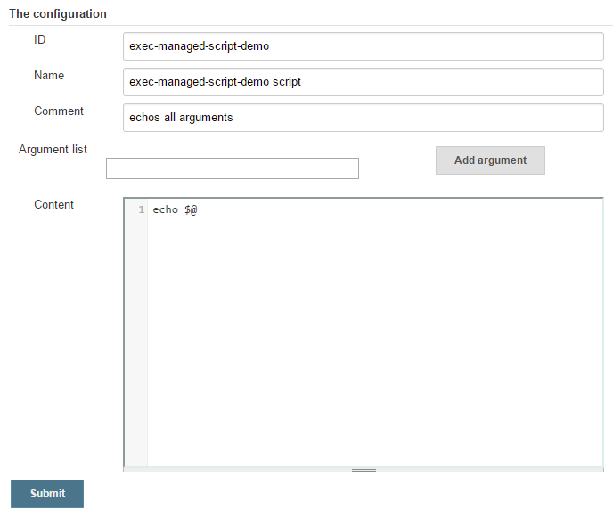

# execManagedShellScript

The purpose of this step is to make the execution of managed shell
scripts easier.

This step takes care about
* providing the managed shell script via the
  [Config File Provider Plugin](https://wiki.jenkins-ci.org/display/JENKINS/Config+File+Provider+Plugin)
* making the shell script executable
* building the command line
* executing the script

# Table of contents
* [Example](#example)
* [Related classes](#related-classes)

## Example

Given a managed shell script with the id `exec-managed-script-demo`
which only echos the provided arguments:



and a pipeline script with this content

```groovy
@Library('pipeline-library') pipelineLibrary

node {
    def result = execManagedShellScript('exec-managed-script-demo',["arg1","arg2","arg3=value"])
    echo "execManagedShellScript result: '$result'"
}
```

and you run the job there will be a console output like this:

```text
[Pipeline] node
Running on some-slave in /some/workspace/Job
[Pipeline] {
[Pipeline] wrap
provisioning config files...
copy managed file [exec-managed-script-demo script] to file:/some/workspace/Job@tmp/config4116095771414952801tmp
[Pipeline] {
[Pipeline] sh
[Doku Test] Running shell script
+ chmod +x '/some/workspace/Job@tmp/config4116095771414952801tmp'
[Pipeline] sh
[Doku Test] Running shell script
+ '/some/workspace/Job@tmp/config4116095771414952801tmp' arg1 arg2 arg3=value
[Pipeline] }
Deleting 1 temporary files
[Pipeline] // wrap
[Pipeline] echo
execManagedShellScript result: 'arg1 arg2 arg3=value'
[Pipeline] }
[Pipeline] // node
[Pipeline] End of Pipeline
```

As you can the the provided arguments were returned by the
`execManagedShellScript` step

## Related classes
* [`CommandBuilder`](../src/io/wcm/devops/jenkins/pipeline/shell/CommandBuilderImpl.groovy)
